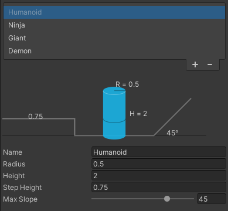

# NavMesh.
## Autor: Álvaro González Rodríguez
alu0101202556

1. Modifica el proyecto "Agentes en el Nav Mesh" para incluir un First Person Controller, de forma que tres tipos distintos de agente persigan al jugador. Crea tipos de agentes con propiedades diferentes para que se generen NavMeshes diferentes para cada tipo (como hicimos en el proyecto "Múltiples NavMesh para distintos tamaños de agente"), de forma que tengan que buscar caminos alternativos para perseguir al jugador.

Se ha agregado el controlador de primera persona del ejercicio del zombie, al igual que el fichero que sirve para perseguir al jugador

Existen 4 tipos de agentes, un humano, un ninja, un gigante y un demonio.

El humano tiene un movimiento sencillo en el cual se mueve a velocidad estandar y solo puede ir por el suelo y puede atravesar cualquier puerta

El ninja es extremadamente delgado para que pueda ir por prácticamente cualquier muro, pero este no puede ir por el suelo

Es el más ancho de todos los agentes, por lo que solo puede moverse por una sala o por un pasillo, ya que no cabe por las puertas

Es el más alto y rápido de todos los agentes. Puede ir por el suelo y los muros pero no puede atravesar la mayoría de las puertas debido a su altura

A continuación un ejemplo del comportamiento de todos los agentes (los archivos .gif pueden tardar en cargar)

Humano

Gigante

Ninja

Demonio

